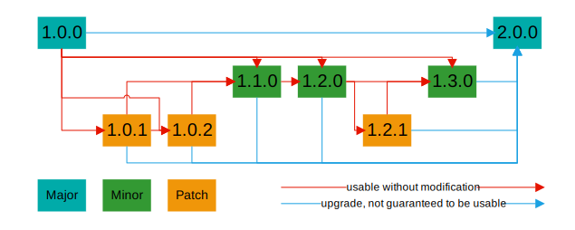

# Self-Describing DID Methods

[Kevin Dean](mailto:kevin@legreq.com), [Legendary Requirements](https://legreq.com)

## Problem

In the spirit of decentralization, DID method names are generated autonomously by the authors of their respective specifications. Generally, a method name is chosen to represent something about the underlying specification, such as a company name (e.g., `did:iota` developed by [IOTA Foundation](https://www.iota.org/)) or the DID resolution protocol (e.g., `did:web`).

This approach can, naturally, lead to conflicting method names being generated, especially with popular resolution protocols (e.g., `did:etho` and `did:ethr` for Ethereum) or with meaningful words in languages that use the Latin alphabet, as occurs with [memorable domain names](https://www.name.com/blog/the-top-10-most-expensive-domains-ever-sold).

To mitigate this risk, section [8.1 Method Syntax](https://www.w3.org/TR/did-core/#method-syntax) of the DID standard states that a DID method specification _SHOULD_ be registered in the DID Specification Registries.

Again in the spirit of decentralization, registration is not mandatory, so the following scenario is entirely conceivable:

> A loose affiliation of pirates creates the `did:iocane` method for their community, choosing the name based on the powder’s stealthy and useful properties as a poison. Service endpoints published in the DID documents cover types such as `plunder`, `recruit`, and `retire`. To maintain absolute anonymity, the method isn’t registered, and knowledge of it is limited to a need-to-know basis.
>
> Sometime later, a pirate ship makes port in Australia, where the captain negotiates the sale of booty to a local purchaser. The captain has several DIDs, built on registered DID methods, that he can use, and he selects one to conclude the sale. The purchaser presents a `did:iocane` DID, but one that conforms to a registered specification, with the name chosen because of the beauty of the plant by that name and despite the poison that can be derived from it. The pirate’s wallet, which knows only about the private `did:iocane` method, fails to resolve the DID of the purchaser, the sale falls through, the crew mutinies, and the captain is deposed in favor of a Spanish member of the crew.

Another problem with the way that DID methods are defined is the lack of version control. Suppose that a DID method specifies a verifiable data registry that is later found to be vulnerable to some form of attack (e.g., denial of service), serious enough to warrant changing the registry or changing the way in which the registry is accessed. The original DID method name is no longer viable, so a new one needs to be defined. This may be as simple as appending a version to the original name (e.g., `did:example2` as a successor to `did:example`), but there’s no way to show any correlation between the two. Furthermore, assuming that the vulnerability isn’t significant enough to warrant shutting down the original DID method entirely, the developers want to maintain some level of compatibility with the original DID method so that verifier software written for it can be used without modification with the new DID method, giving verifiers time to upgrade without compromising their business processes.

## Requirements

### Collision

DID method names SHALL be generated in such a way that there is a negligible risk of collision.

### Security

DID method names SHOULD be generated in such a way that they can be verified against some external, related content.

### Version Control

DID methods SHOULD advertise compatible DID methods that are usable without modification in processes involving the original DID method.

DID methods SHOULD advertise a replacement DID method that is an upgrade to the original DID method, not guaranteed to be usable without modification in processes involving the original DID method.

#### Semantic Versioning

To simplify the version control requirement further, versioning SHOULD align with the MAJOR.MINOR.PATCH concepts behind [Semantic Versioning 2.0.0](https://semver.org/), namely that:

- incrementing the MAJOR version denotes incompatible API changes;
- incrementing the MINOR version denotes functionality added in a backward-compatible manner; and
- incrementing the PATCH version denotes bug fixes made in a backward-compatible manner.

If semantic versioning is used then:

- A MAJOR.0.0 version SHALL advertise all its MAJOR.MINOR.0 (MINOR ≠ 0) versions as usable without modification.
- A MAJOR.MINOR.0 version (MINOR ≠ 0) SHALL advertise the next MAJOR.MINOR’.0 (MINOR’ = MINOR + 1) version as usable without modification.
- A MAJOR.MINOR.0 version SHALL advertise all its MAJOR.MINOR.PATCH (PATCH ≠ 0) versions as usable without modification.
- A MAJOR.MINOR.PATCH version (PATCH ≠ 0) SHALL advertise the next MAJOR.MINOR.PATCH’ (PATCH’ = PATCH + 1) version as usable without modification.
- All MAJOR.MINOR.PATCH versions SHALL advertise the next MAJOR’.0.0 (MAJOR’ = MAJOR + 1) version as an upgrade, not guaranteed to be usable without modification.

These statements may be illustrated as follows:



Furthermore, any MAJOR.MINOR.PATCH MAY advertise any later MAJOR.MINOR’.PATCH’ (MINOR’ = MINOR and PATCH’ > PATCH or MINOR’ > MINOR) version as usable without modification.

## Proposal

### Method Name Generation

To eliminate the possibility of method name overloading, names SHALL be set by some well-defined randomization algorithm. Some options are:

- random fixed-length string generation using a [cryptographically secure pseudorandom number generator](https://en.wikipedia.org/wiki/Cryptographically_secure_pseudorandom_number_generator);
- UUID generation per [RFC 9562](https://www.rfc-editor.org/rfc/rfc9562.html) (version 7 recommended), minus hyphens; and
- the hash of some document accessible to users of the DID method.

This satisfies the [Collision](#collision) requirement.

The last option could be implemented as the hash of the DID method specification. For the sake of this discussion, that option will be assumed. This satisfies the [Security](#security) requirement.

For future-proofing, the hash SHALL be represented using [multihash](https://github.com/multiformats/multihash), encoded in lowercase [Base36](https://en.wikipedia.org/wiki/Base36) to minimize the method name length.

If version control is not required, or if new versions will be advertised out-of-band (e.g., through a public or private messaging service), no further work needs to be done.

### Version Advertisement

For a DID method to be able to advertise new versions of itself, there SHALL be a way to query it, in a way that is accessible to all parties authorized to use the DID method, either in DID generation or in DID verification. If there are restrictions around the use of a DID (e.g., access to the DID method’s verifiable data registry requires presentation of some authorization token), those same restrictions MAY apply to querying the DID method.

Supporting version advertisement requires standardization of the advertisement attributes. The recommended top-level attributes are:

<table>
  <tr>
   <th><strong>Attribute</strong>
   </th>
   <th><strong>Type</strong>
   </th>
   <th><strong>Definition</strong>
   </th>
  </tr>
  <tr>
   <td>method
   </td>
   <td>Method
   </td>
   <td>Method object defining the DID method. Required.
   </td>
  </tr>
  <tr>
   <td>compatibleMethods
   </td>
   <td>Method[]
   </td>
   <td>Array of Method objects defining compatible methods. Optional.
   </td>
  </tr>
  <tr>
   <td>replacementMethod
   </td>
   <td>Method
   </td>
   <td>Method object defining the replacement method. Optional.
   </td>
  </tr>
</table>

The recommended Method object attributes are:

<table>
  <tr>
   <th><strong>Attribute</strong>
   </th>
   <th><strong>Type</strong>
   </th>
   <th><strong>Definition</strong>
   </th>
  </tr>
  <tr>
   <td>id
   </td>
   <td>URI
   </td>
   <td>The URI representing the DID method. Required.
   </td>
  </tr>
  <tr>
   <td>version
   </td>
   <td>string
   </td>
   <td>The semantic version represented by the DID method name. Optional.
   </td>
  </tr>
  <tr>
   <td>published
   </td>
   <td>timestamp
   </td>
   <td>The date and time, in XML Datetime format, when the version was published. Optional.
   </td>
  </tr>
  <tr>
   <td>specification
   </td>
   <td>URI
   </td>
   <td>The URI representing the DID method specification. Optional.
   </td>
  </tr>
</table>

Without having to invent any new standard, there are three options for the DID method to provide this data. All three depend on the DID method having its own ID, and it is proposed that the ID be a DID URI within the same DID method. This has the advantage that any client capable of interacting with DIDs within the DID method will also be capable of interacting with the DID identifying the DID method.

The three options for the DID method to provide this data are:

- within the DID document data;
- within the DID document metadata; or
- via a service associated with the DID.

Providing the data within the DID document data is likely the easiest for client applications, but it depends on the DID document being updatable, which is not always the case. DID document metadata has a similar issue with updatability. Using a service provides the most flexibility as the mutable nature of the data better aligns with the concept of a service: data returned by a service is expected to vary based on implicit parameters such as the date and time of the request. Furthermore, the "Version” (proposed) service type can be included in every DID document for the method, allowing the query to take place using any DID for the DID method.

### Implementation

Because the method name is the hash of the method specification, it’s not possible to include the method name in the specification itself. Instead, the specification SHALL include the following statement:

> The method name for this specification is the _&lt;hash algorithm name>_ hash of this document, represented using [multihash](https://github.com/multiformats/multihash), encoded in lowercase [Base36](https://en.wikipedia.org/wiki/Base36).

For the DID representing the DID method to be known, the specification MAY include the following statement:

> The DID representing the DID method for this specification is <code>did:<em>method-name</em>:<em>&lt;method-specific-id></em></code>.

Depending on the algorithm for generating the method-specific ID, it may not be possible to know it at the time that the specification is finalized, so it may instead be shared through some out-of-band mechanism.

### Standardization

There are two paths to standardization.

The preferred option is to update the DID standard to support self-describing DID methods. The DID working group has reconvened, and it’s a good opportunity to put this forward as a requirement, assuming that it’s in scope of the current charter.

The alternative is to register a new DID method (e.g., “x”), to support self-describing DID methods as sub-methods. This would include registration of the additional attributes and the "Version” service type.

## Scenarios

These scenarios assume that the self-describing DID method is at the top level (i.e., not subordinate to another DID method such as “x”) and that version information is published through a service endpoint.

### DID Method Development

Legendary Requirements proposes a Bitcoin-based DID method. Rather than reserve a Bitcoin-like method name (e.g., “btclr”) for it, they opt to make it self-describing.

DIDs for this method use a Bitcoin address as the method-specific identifier, and one is reserved specifically for the method. The specification contains the following statements:

> The method name for this specification is the SHA-256 hash of this document, represented using [multihash](https://github.com/multiformats/multihash), encoded in lowercase [Base36](https://en.wikipedia.org/wiki/Base36).
>
> The DID representing the DID method for this specification is <code>did:<em>method-name</em>:bc1qsvqcrsqhzmsfrn45jlsctsfmjw7yeq38dvn9v2</code>.

Once finalized, the hash is calculated and the final DID for the method is determined to be `did:mugx0x8lmmlu9m5ysvjrq222spgz8aovnrgbco63zzuutdztwbsu:bc1qsvqcrsqhzmsfrn45jlsctsfmjw7yeq38dvn9v2`. The method name and DID are published to the (private or public) community, with the DID document for the method appearing as follows:

```json
{
  "@context": [
    "https://www.w3.org/ns/did/v2",
    "..."
  ],
  "id": "did:mugx0x8lmmlu9m5ysvjrq222spgz8aovnrgbco63zzuutdztwbsu:bc1qsvqcrsqhzmsfrn45jlsctsfmjw7yeq38dvn9v2",
  "authentication": [
    "..."
  ],
  "service": [
    {
      "id": "did:mugx0x8lmmlu9m5ysvjrq222spgz8aovnrgbco63zzuutdztwbsu:bc1qsvqcrsqhzmsfrn45jlsctsfmjw7yeq38dvn9v2#version-1",
      "type": "Version",
      "serviceEndpoint": "ipns://QmRnywyciVGEKdd1sYR6rpiF27DPRkKBdKkYNBaPtdCmDN"
    }
  ]
}
```

The DID document contains an authentication method and a “Version” service endpoint. The endpoint uses the InterPlanetary Naming System protocol to locate the version file, making it persistent, updatable, and discoverable. The initial file contains the following:

```json
{
  "method": {
    "id": "did:mugx0x8lmmlu9m5ysvjrq222spgz8aovnrgbco63zzuutdztwbsu:bc1qsvqcrsqhzmsfrn45jlsctsfmjw7yeq38dvn9v2",
    "version": "1.0.0",
    "published": "2023-01-27T15:00:00Z",
    "specification": "ipfs://QmXApLFURjcNLiBJNEFMci7gAeoUnx411RLBhRjzHWiq9f"
  }
}
```

### Patch Version

After release, users note some inconsistencies in the specification. Legendary Requirements updates the specification with some errata, none of which have an effect on previously-created DIDs. The new version is published with a new DID method name, with the DID document for the method appearing as follows:

```json
{
  "@context": [
    "https://www.w3.org/ns/did/v2",
    "..."
  ],
  "id": "did:muiilbl2232lh8pbbn8zcm4s8eiarsg5ahd2tvxqj3r9pfj7zv5t:bc1qsvqcrsqhzmsfrn45jlsctsfmjw7yeq38dvn9v2",
  "authentication": [
    "..."
  ],
  "service": [
    {
      "id": "did:muiilbl2232lh8pbbn8zcm4s8eiarsg5ahd2tvxqj3r9pfj7zv5t:bc1qsvqcrsqhzmsfrn45jlsctsfmjw7yeq38dvn9v2#version-1",
      "type": "Version",
      "serviceEndpoint": "ipns://Qmb8udPuUo9ckGUQ2uMSktaHqQ6FFdSNK3aoFZjgj6P1xr"
    }
  ]
}
```

The DID document is much the same as before, with the updated DID method name and an updated “Version” service endpoint. Querying the service endpoint for the original version now returns the following:

```json
{
  "method": {
    "id": "did:mugx0x8lmmlu9m5ysvjrq222spgz8aovnrgbco63zzuutdztwbsu:bc1qsvqcrsqhzmsfrn45jlsctsfmjw7yeq38dvn9v2",
    "version": "1.0.0",
    "published": "2023-01-27T15:00:00Z",
    "specification": "ipfs://QmXApLFURjcNLiBJNEFMci7gAeoUnx411RLBhRjzHWiq9f"
  },
  "compatibleMethods": [
    {
      "id": "did:muiilbl2232lh8pbbn8zcm4s8eiarsg5ahd2tvxqj3r9pfj7zv5t:bc1qsvqcrsqhzmsfrn45jlsctsfmjw7yeq38dvn9v2",
      "version": "1.0.1",
      "published": "2023-02-17T03:00:00Z",
      "specification": "ipfs://QmVqJyXNPf25tnsXAQkPtviYvCtkAWK5UZHqWuUF9g8onY"
    }
  ]
}
```

Querying the service endpoint for the patch version returns the following:

```json
{
  "method": {
    "id": "did:muiilbl2232lh8pbbn8zcm4s8eiarsg5ahd2tvxqj3r9pfj7zv5t:bc1qsvqcrsqhzmsfrn45jlsctsfmjw7yeq38dvn9v2",
    "version": "1.0.1",
    "published": "2023-02-17T03:00:00Z",
    "specification": "ipfs://QmVqJyXNPf25tnsXAQkPtviYvCtkAWK5UZHqWuUF9g8onY"
  }
}
```

Note that this is identical to the first compatible method for the original version, as expected.

### DID Creation

A developer creates a wallet app that uses the version 1.0.0 DID method created by Legendary Requirements. As DID wallet is approaching production deployment, the developer checks for any updates and discovers patch version 1.0.1. She reviews the specification and determines that there is nothing that would affect her code, so she updates the DID method name, reruns the tests, and deploys the wallet app.

### Minor Version

Legendary Requirements updates the specification to add a new feature without breaking existing functionality. The new version is published with a new DID method name, with the DID document for the method appearing as follows:

```json
{
  "@context": [
    "https://www.w3.org/ns/did/v2",
    "..."
  ],
  "id": "did:muhkjpec6ivnuxbyw9hu0ffoahm5n0wvoq0vq4n2zx3ekyvz6ghf:bc1qsvqcrsqhzmsfrn45jlsctsfmjw7yeq38dvn9v2",
  "authentication": [
    "..."
  ],
  "service": [
    {
      "id": "did:muhkjpec6ivnuxbyw9hu0ffoahm5n0wvoq0vq4n2zx3ekyvz6ghf:bc1qsvqcrsqhzmsfrn45jlsctsfmjw7yeq38dvn9v2#version-1",
      "type": "Version",
      "serviceEndpoint": "ipns://Qmaafp2Kx6vaqG7LMXoJzoQjpi9RJxBddvfuW764KvuRdq"
    }
  ]
}
```

Querying the service endpoint for the original version now returns the following:

```json
{
  "method": {
    "id": "did:mugx0x8lmmlu9m5ysvjrq222spgz8aovnrgbco63zzuutdztwbsu:bc1qsvqcrsqhzmsfrn45jlsctsfmjw7yeq38dvn9v2",
    "version": "1.0.0",
    "published": "2023-01-27T15:00:00Z",
    "specification": "ipfs://QmXApLFURjcNLiBJNEFMci7gAeoUnx411RLBhRjzHWiq9f"
  },
  "compatibleMethods": [
    {
      "id": "did:muiilbl2232lh8pbbn8zcm4s8eiarsg5ahd2tvxqj3r9pfj7zv5t:bc1qsvqcrsqhzmsfrn45jlsctsfmjw7yeq38dvn9v2",
      "version": "1.0.1",
      "published": "2023-02-17T03:00:00Z",
      "specification": "ipfs://QmVqJyXNPf25tnsXAQkPtviYvCtkAWK5UZHqWuUF9g8onY"
    },
    {
      "id": "did:muhkjpec6ivnuxbyw9hu0ffoahm5n0wvoq0vq4n2zx3ekyvz6ghf:bc1qsvqcrsqhzmsfrn45jlsctsfmjw7yeq38dvn9v2",
      "version": "1.1.0",
      "published": "2023-09-10T20:00:00Z",
      "specification": "ipfs://QmYHh1AWSNVerTmpm5qyN8hNf8cQWoHLCCuSX2VuNzbbit"
    }
  ]
}
```

Querying the service endpoint for the patch version returns the following:

```json
{
  "method": {
    "id": "did:muiilbl2232lh8pbbn8zcm4s8eiarsg5ahd2tvxqj3r9pfj7zv5t:bc1qsvqcrsqhzmsfrn45jlsctsfmjw7yeq38dvn9v2",
    "version": "1.0.1",
    "published": "2023-02-17T03:00:00Z",
    "specification": "ipfs://QmVqJyXNPf25tnsXAQkPtviYvCtkAWK5UZHqWuUF9g8onY"
  },
  "compatibleMethods": [
    {
      "id": "did:muhkjpec6ivnuxbyw9hu0ffoahm5n0wvoq0vq4n2zx3ekyvz6ghf:bc1qsvqcrsqhzmsfrn45jlsctsfmjw7yeq38dvn9v2",
      "version": "1.1.0",
      "published": "2023-09-10T20:00:00Z",
      "specification": "ipfs://QmYHh1AWSNVerTmpm5qyN8hNf8cQWoHLCCuSX2VuNzbbit"
    }
  ]
}
```

Querying the service endpoint for the minor version returns the following:

```json
{
  "method": {
    "id": "did:muhkjpec6ivnuxbyw9hu0ffoahm5n0wvoq0vq4n2zx3ekyvz6ghf:bc1qsvqcrsqhzmsfrn45jlsctsfmjw7yeq38dvn9v2",
    "version": "1.1.0",
    "published": "2023-09-10T20:00:00Z",
    "specification": "ipfs://QmYHh1AWSNVerTmpm5qyN8hNf8cQWoHLCCuSX2VuNzbbit"
  }
}
```

### Minor Version Presentation

Verifier software that supports Legendary Requirements’s Bitcoin-based DID method (among others) is given a verifiable presentation with an unfamiliar DID method. Verification is suspended while the verifier checks the “Version” service endpoints of all supported self-describing DID methods and discovers that the unknown DID method is for version 1.1.0 of the Legendary Requirements’s Bitcoin-based DID method.

Because the software understands how to interact with version 1.0.0, it can support the new DID method (though not its new features), so it adds the DID method to the table and continues with the presentation verification. Optionally, it sends a notification to the developers indicating that a new minor release is available so that they may investigate it.

### Major Version

Legendary Requirements reworks the DID method to take advantage of new features in the Bitcoin lighting protocol. The new version is incompatible with prior versions and so is given a new major version number. The new version is published with a new DID method name and Bitcoin address, with the DID document for the method appearing as follows:

```json
{
  "@context": [
    "https://www.w3.org/ns/did/v2",
    "..."
  ],
  "id": "did:mufcbql5ys1tk9vm942tsihusqso9nkcf3tyxtrrv1xkekap18ck:bc1q5nml2l4eu92za637c6st8t9fus37xrl0a4au20",
  "authentication": [
    "..."
  ],
  "service": [
    {
      "id": "did:mufcbql5ys1tk9vm942tsihusqso9nkcf3tyxtrrv1xkekap18ck:bc1q5nml2l4eu92za637c6st8t9fus37xrl0a4au20#version-1",
      "type": "Version",
      "serviceEndpoint": "ipns://QmTnmu8pNoAAijwarFY3zwi6UQ2b726tniyTHkYXjDK2Eq"
    }
  ]
}
```

Querying the service endpoint for the original version now returns the following:

```json
{
  "method": {
    "id": "did:mugx0x8lmmlu9m5ysvjrq222spgz8aovnrgbco63zzuutdztwbsu:bc1qsvqcrsqhzmsfrn45jlsctsfmjw7yeq38dvn9v2",
    "version": "1.0.0",
    "published": "2023-01-27T15:00:00Z",
    "specification": "ipfs://QmXApLFURjcNLiBJNEFMci7gAeoUnx411RLBhRjzHWiq9f"
  },
  "compatibleMethods": [
    {
      "id": "did:muiilbl2232lh8pbbn8zcm4s8eiarsg5ahd2tvxqj3r9pfj7zv5t:bc1qsvqcrsqhzmsfrn45jlsctsfmjw7yeq38dvn9v2",
      "version": "1.0.1",
      "published": "2023-02-17T03:00:00Z",
      "specification": "ipfs://QmVqJyXNPf25tnsXAQkPtviYvCtkAWK5UZHqWuUF9g8onY"
    },
    {
      "id": "did:muhkjpec6ivnuxbyw9hu0ffoahm5n0wvoq0vq4n2zx3ekyvz6ghf:bc1qsvqcrsqhzmsfrn45jlsctsfmjw7yeq38dvn9v2",
      "version": "1.1.0",
      "published": "2023-09-10T20:00:00Z",
      "specification": "ipfs://QmYHh1AWSNVerTmpm5qyN8hNf8cQWoHLCCuSX2VuNzbbit"
    }
  ],
  "replacementMethod": {
    "id": "did:mufcbql5ys1tk9vm942tsihusqso9nkcf3tyxtrrv1xkekap18ck:bc1q5nml2l4eu92za637c6st8t9fus37xrl0a4au20",
    "version": "2.0.0",
    "published": "2024-05-27T22:00:00Z",
    "specification": "ipfs://QmPYtDfWv9YmSPGgQDY3SDu6qLqfSu8jbbqEh23hMtvV36"
  }
}
```

Similarly, patch version 1.0.1 and minor version 1.1.0 have the `replacementMethod` attribute added to their version files.

Querying the service endpoint for the new major version returns the following:

```json
{
  "method": {
    "id": "did:mufcbql5ys1tk9vm942tsihusqso9nkcf3tyxtrrv1xkekap18ck:bc1q5nml2l4eu92za637c6st8t9fus37xrl0a4au20",
    "version": "2.0.0",
    "published": "2024-05-27T22:00:00Z",
    "specification": "ipfs://QmPYtDfWv9YmSPGgQDY3SDu6qLqfSu8jbbqEh23hMtvV36"
  }
}
```

### Major Version Presentation

Verifier software that supports Legendary Requirements’s Bitcoin-based DID method (among others) is given a verifiable presentation with an unfamiliar DID method. Verification is suspended while the verifier checks the “Version” service endpoints of all supported self-describing DID methods and discovers that the unknown DID method is for version 2.0.0 of the Legendary Requirements’s Bitcoin-based DID method.

Because the DID method is a replacement, the software doesn’t understand how to interact with it, so it rejects the presentation and sends a notification to the developers indicating that a new major release is available so that they may investigate it.

## Security Considerations

TBD.
